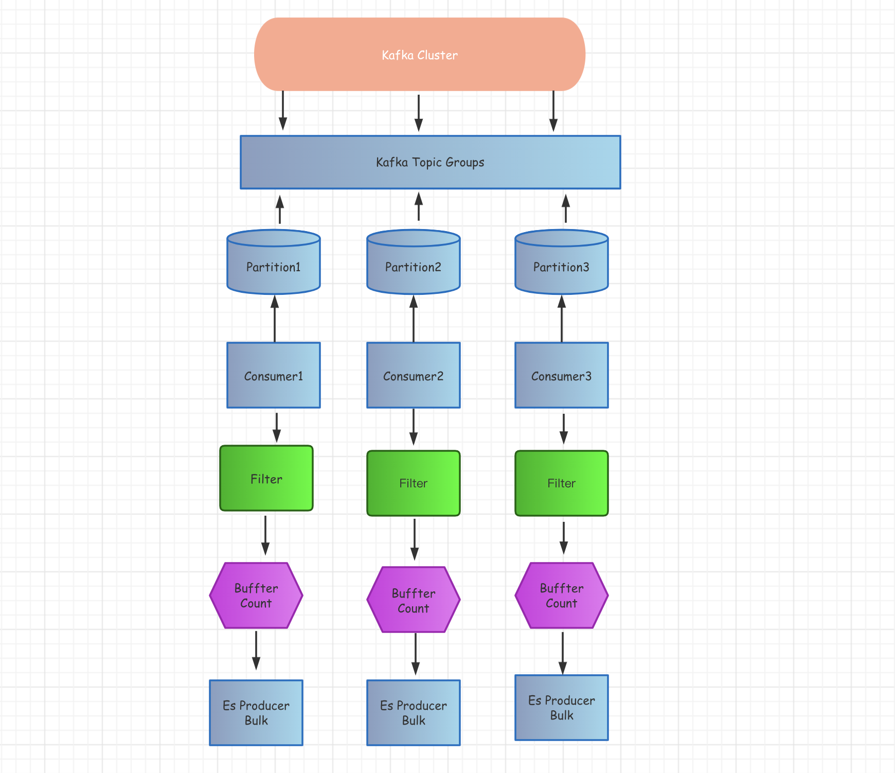

# kafka-forward-elasticsearch 
Write es by consuming kafka data



is composed of three parts:

1. Start the kafka worker to start the same amount according to the number of partitions
2. Each worker listens to the messages of the kafka partition, and performs some message filtering, customization, adding fields, etc.
3. Each worker establishes a connection with elasticsearch. After customizing the data consumed from kafka, it is temporarily written to the buffer. When the upper limit is reached, batch writing is performed.

## ascendancy
The current consumption and writing speed are almost real-time, and there will be no delay problem

## Applicable scene
1. Collect business logs, such as Nginx, and write to elasticsearch to provide queries
2. Real-time collection scenarios, such as customizing some logs, adding new fields to the original logs, such as the business line field corresponding to the domain name of the business log, etc.


```go
func main() {

    doneCh := make(chan os.Signal)
    
    // input required parameter
    inputParameter := input.Parameter{
        // kafka connect address
        Addr: []string{
        "127.0.0.1:9092",
        "10.10.100.1:9092",
        },
        // kafka consume group
        Group: "log_forwarder_ap_candidate_2",
        // kafka consume topic
        Topic: "log-topic",
        // output consume return errors message
        ConsumerReturnErrors: true,
        // consume mode
        // - -1 news consume
        // - 0 old consume
        OffsetsInitial: -1,
    }
    
    // output required parameter
    outputParameter := output.Parameter{
        // es connect address
        Addr: []string{
        "http://172.182.1.1:9270",
        "http://172.182.1.2:9270",
        },
        // es batch insert count
        BulkLimit: 10000,
        // es insert retry count
        Retry: 10,
        // es index prefix
        IndexPrefix: "ee-sla-abcd",
    }
    
    // custom message design
    filterClaimFunc := func(topic string, msg []byte) ([]byte, error) {
        //klog.Infof("topic: %s, msg: %s", topic, msg)
        return msg, nil
    }
    
    forwarder, err := forward.NewForwarder(
        inputParameter,
        outputParameter,
        filterClaimFunc,
    )
    
    if err != nil {
        klog.Errorf("forwarder init fail: %s", err.Error())
        return
    }
    
    go forwarder.Start()
    
    signal.Notify(
        doneCh,
        syscall.SIGTERM,
        syscall.SIGHUP,
        syscall.SIGINT,
        syscall.SIGQUIT,
        os.Interrupt,
        os.Kill,
    )
    
    <-doneCh
    
    forwarder.Stop()
}
